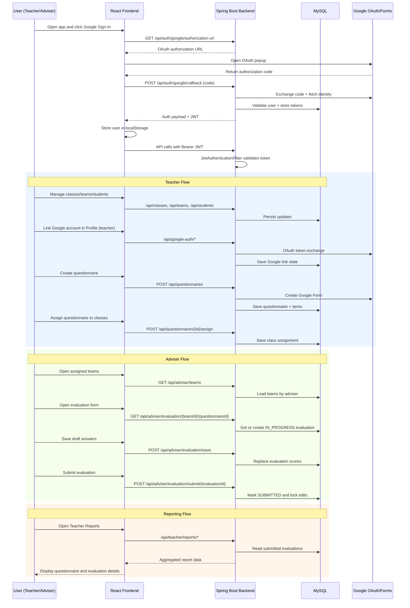

# Project Flow Diagram

## System Sequence (Simplified)

```mermaid
sequenceDiagram
    participant U as User (Teacher/Adviser)
    participant FE as React Frontend
    participant BE as Spring Boot Backend
    participant DB as MySQL
    participant GG as Google OAuth/Forms

    U->>FE: Open app and click Google Sign-In
    FE->>BE: GET /api/auth/google/authorization-url
    BE-->>FE: OAuth authorization URL
    FE->>GG: Open OAuth popup
    GG-->>FE: Return authorization code
    FE->>BE: POST /api/auth/google/callback (code)
    BE->>GG: Exchange code + fetch identity
    BE->>DB: Validate user + store tokens
    BE-->>FE: Auth payload + JWT
    FE->>FE: Store user in localStorage

    FE->>BE: API calls with Bearer JWT
    BE->>BE: JwtAuthenticationFilter validates token

    rect rgb(235,245,255)
    Note over U,DB: Teacher Flow
    U->>FE: Manage classes/teams/students
    FE->>BE: /api/classes, /api/teams, /api/students
    BE->>DB: Persist updates

    U->>FE: Link Google account in Profile (teacher)
    FE->>BE: /api/google-auth/*
    BE->>GG: OAuth token exchange
    BE->>DB: Save Google link state

    U->>FE: Create questionnaire
    FE->>BE: POST /api/questionnaires
    BE->>GG: Create Google Form
    BE->>DB: Save questionnaire + items

    U->>FE: Assign questionnaire to classes
    FE->>BE: POST /api/questionnaires/{id}/assign
    BE->>DB: Save class assignment
    end

    rect rgb(245,255,235)
    Note over U,DB: Adviser Flow
    U->>FE: Open assigned teams
    FE->>BE: GET /api/adviser/teams
    BE->>DB: Load teams by adviser

    U->>FE: Open evaluation form
    FE->>BE: GET /api/adviser/evaluation/{teamId}/{questionnaireId}
    BE->>DB: Get or create IN_PROGRESS evaluation

    U->>FE: Save draft answers
    FE->>BE: POST /api/adviser/evaluation/save
    BE->>DB: Replace evaluation scores

    U->>FE: Submit evaluation
    FE->>BE: POST /api/adviser/evaluation/submit/{evaluationId}
    BE->>DB: Mark SUBMITTED and lock edits
    end

    rect rgb(255,245,235)
    Note over U,DB: Reporting Flow
    U->>FE: Open Teacher Reports
    FE->>BE: /api/teacher/reports/*
    BE->>DB: Read submitted evaluations
    BE-->>FE: Aggregated report data
    FE-->>U: Display questionnaire and evaluation details
    end
```
